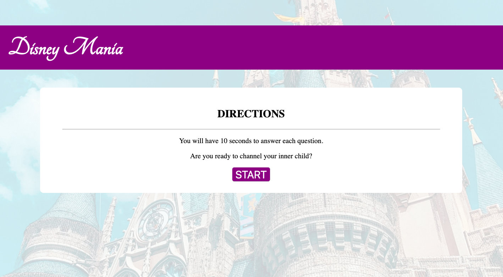
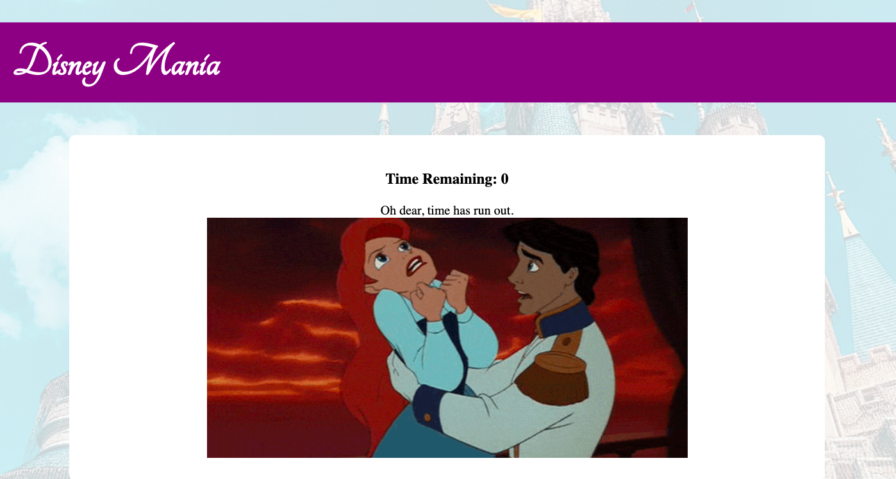
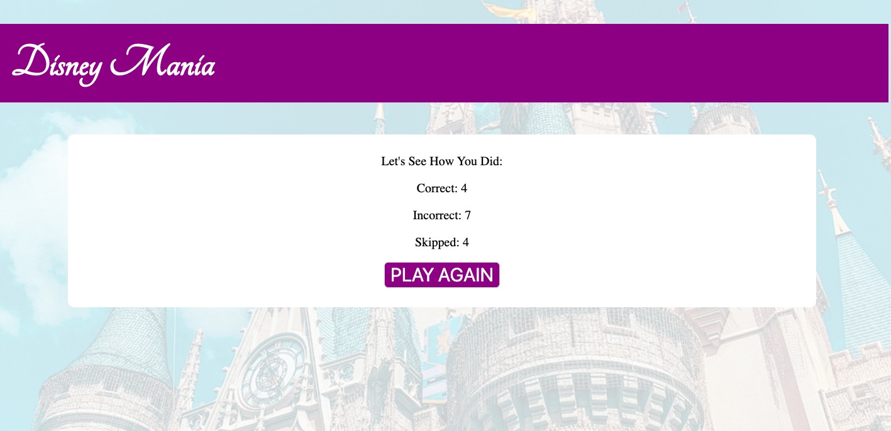

# Trivia-Game

# A Disney Inspired Trivia Game
User will have 10 seconds/question to select thier answer by clicking on their answer choice.
After each qeustion has been answered, the User will be informed if their answer choice is correct or inccorect.
Once all 15 questions have been answered, their results will be displayer. 
User will have the oppurtunity to restart the game and try again. To make the game harder, the answers are not provided with answered incorrectly.

# Test Your Skills
https://kaiisha05.github.io/Trivia-Game/

# Screenshots

# Technologies Used
*Google Fonts
*JQuery

